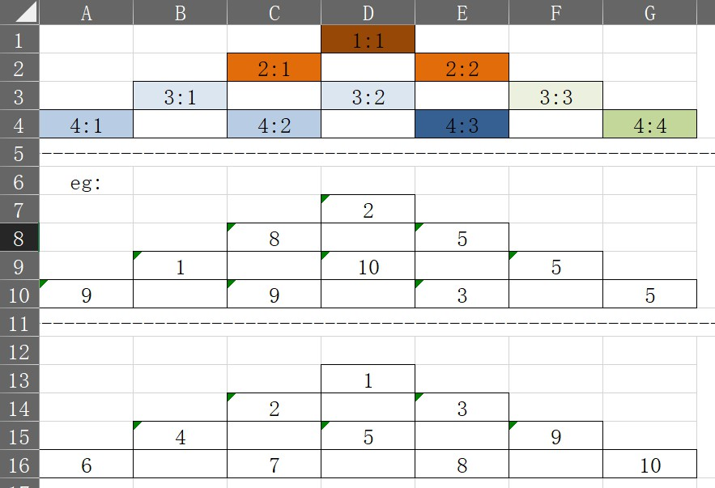
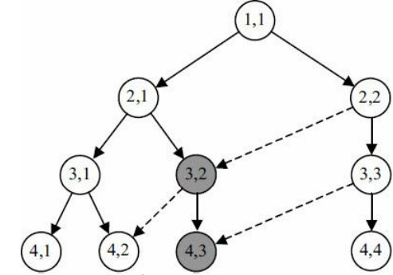

数学三角：\
\
最上方也为函数的调用顺序\
最下方为函数的调用顺序\
中间为初始数据\
要点：\
{\
\
    初始数据保存到数组a中\
\
    另外开辟一个数组b先全部赋同一个初值\
\
    函数的递归\
\
    将运算结果保存到数组b中，函数的递归时根据数组b是否为初始值判断是否已经被计算过\
    如果是计算过就不重复运算，否则继续运算，由此来减少时间复杂度\
}\
未优化
\
<----------------------------------------------------------------------------------->\
优化后
