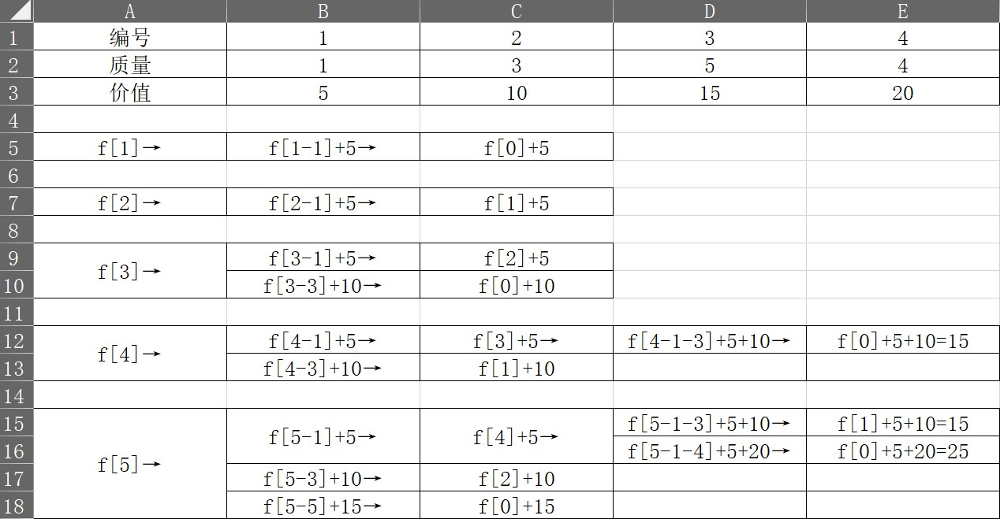

每件物品只能选一次

判断将当前“物品”放入“背包”后的价值是否大于不将当前“物品”放入“背包”后的价值\
需要使用二维数组\
for(i=1;i<=n;i++)\
{\
    for(j=0;j<=m;j++)\
        f[i][j]=f[i-1][j];\
        //不将当前“物品”放入“背包”\
\
    for(j=v[i];j<=m;j++)\
        f[i][j]=max(f[i][j],f[i-1][j-v[i]]+w[i]);\
        //将当前“物品”放入“背包”\
}\

/------------------------使用滚动数组对使用空间优化-------------------------------/\
二维化简为一维\
\
由于\
f[i][j]=f[i-1][j];\
只与当前矩阵的上一行有关，而且未对数据进行更新只是对数据进行了单纯的复制，所以该代码可以不写\
\
f[i][j]=max(f[i-1][j],f[i-1][j-v[i]]+w[i]);\
该代码可以化简为一维数组：\
\
f[j]=max(f[j],f[j-v[i]]+w[i]);\
注意必须使用倒序遍历\
for(i=0;i<=n;i++)\
for(j=m;j>=w[i];j--)\
f[j]=max(f[j],f[j-v[i]]+w[i]);\
\
以下是正序的结果，使得各个物品重复添加\
\
以下是当背包容量为5时的所有情况\
